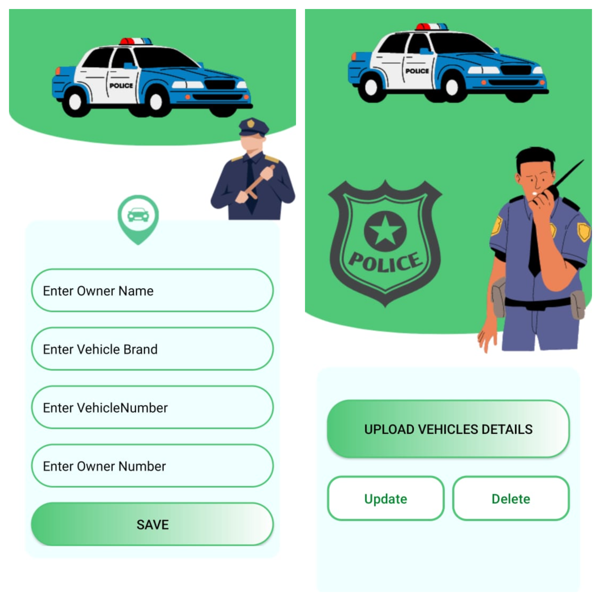

# RTO-vehicle-Info
• RTO Vehicle App is a Kotlin-based Android application that facilitates CRUD
(Create, Read, Update, Delete) operations to store and manage data related to
vehicles, including vehicle names and owner names. 
• Additionally, it provides a mechanism to display this data to another
application, enhancing data sharing and accessibility 
# Here is the some glimpse of app

